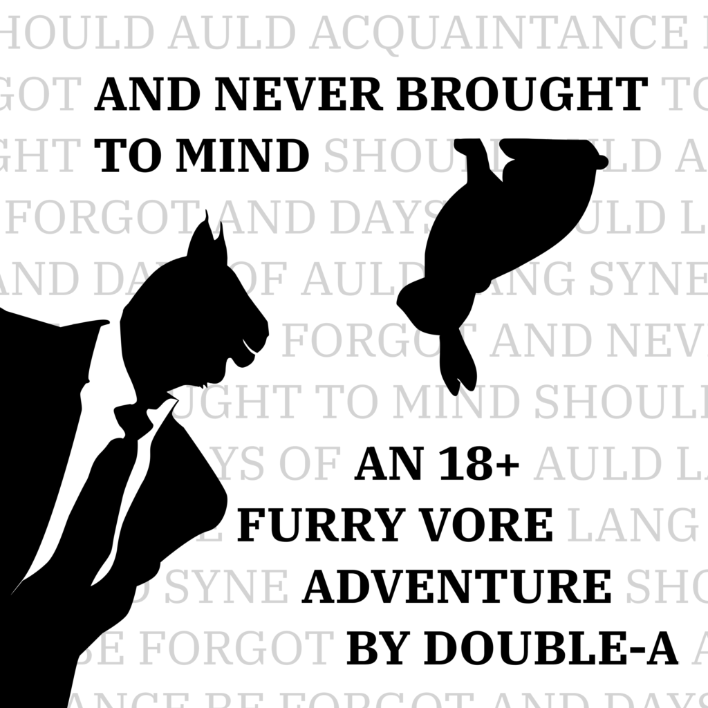

# And Never Brought to Mind

An 18+ Furry Vore Adventure by Double-A

This is a NSFW interactive story written in [Twee 3](https://github.com/iftechfoundation/twine-specs/blob/master/twee-3-specification.md) using [Snowman](https://videlais.github.io/snowman/2/).

⚠️ **CONTENT WARNING:** This story is for **adults only**, and reader discretion is strongly advised. It contains **strong fetish content**, including but not limited to: *Soft vore. Dubious consent. Unwilling digestion. Sex. Violence. Sexual violence. Masturbation. Sadism. Blood. Post-vore scat disposal. Death.*
## About the story (18+)

* [ABOUT.MD](ABOUT.md)
## License

© 2024 Double-A, some rights reserved.

The text of this story is licensed under [CC BY-NC-SA 4.0](https://creativecommons.org/licenses/by-nc-sa/4.0/). You are free to share and adapt this content in any medium or format **with attribution** for **non-commercial purposes** under **the same license**. If you choose to create an adaptation of this story (i.e. new routes, new characters, etc) you must clearly indicate that it has been modified from the original.

All ***code*** (i.e. config, scripts, stylesheets, file structure) which does not contain my copyrighted characters, writing, or artwork, is additionally licensed under the [MIT-0 license](/LICENSE-CODE). You are free to use, modify, and relicense any or all of this code for any purpose **without attribution**.

## Building from source

1. Install [Tweego](http://www.motoslave.net/tweego/) and [NodeJS](https://nodejs.org/).
2. `npm start` - Launch live server for development
3. `npm run build` - Generates game HTML in `dist`
4. `npm run proof` – Builds proof-reading/analysis tools in `proofing`